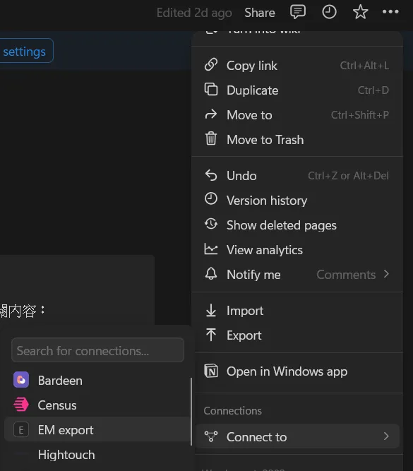

# 有人在水 - 統計 Notion 待辦事項放到 Discord 頻道

> 孔子能從心所欲不逾矩。正是因為他已經掌握 GitHub Actions，能夠根據自己的需求自動化操作。

> 今日範例程式: <https://github.com/Edit-Mr/2024-GitHub-Actions/tree/main/17>

今天，我們將介紹如何使用 Bash 腳本或 Node.js 編寫 GitHub Actions，自動從 Notion 獲取待辦事項並更新到 Discord 頻道。希望能透過這個小專題幫助你了解如何利用進行自動化操作呼叫 API。如果你不會使用 Notion 的話，~~那你該去學學。~~你可以參考大致的流程與程式的邏輯。

首先讓我們看一下成果。你可以看到 Discord 頻道的標題會根據 Notion 中的待辦事項進行更新。


## 事前準備：建立 Notion 資料庫並獲取 API

我們在開始之前需要獲得幾個變數：

### Notion 資料庫 ID

在我們開始時做之前請先打開 Notion 建立一個資料庫。這裡我以中電會的 Notion 為例。可以看到左到右分別是預設的 To-do、In progress、Complete。我們將會從這個資料庫中獲取待辦事項。


開啟資料庫連結並複製 ID。記得要點擊 view database 進入整個畫面都是資料庫的頁面喔。比如說如下的連結：

```
https://www.notion.so/6e7c50281a8b406dbxxxxxxxx7892659?v=fe8e4b0c57e24axxxxxxxxxx13271567
```

這個連結中的 `6e7c50281a8b406dbxxxxxxxx7892659` 就是資料庫 ID。


### 取得 API Token

在 Notion 的設定中，可以取得 API Token。這個 Token 將會用來取得資料庫的資料。請記得不要將這個 Token 洩漏給他人。請至 [Notion Developers](https://www.notion.so/my-integrations) 取得 API，輸入基本資料並選擇要應用的 Workspace。


請你複製這一串 Integration Token。生成完 API 之後，記得要邀請你剛才創建的機器人。點擊 Notion 右上角的三個點，Connect to，並選擇剛才創建的機器人。




### 建立 Discord Bot

在 Discord 開發者中心建立一個 Bot，並取得 Token。這個 Token 將會用來更新 Discord 頻道的標題。請至 [Discord Developer Portal](https://discord.com/developers/applications) 建立一個新的應用程式。

### Discord 頻道 ID

在 Discord 中，請先開啟開發者模式，接著右鍵要更新的頻道，並複製頻道 ID。這個 ID 將用於更新頻道的標題。這個頻道原則上就是用來顯示數字用的，所以可以鎖定權限讓其他人不能在裡面聊天。

> 開發者模式在 Discord 中的位置：設定 -> 進階 -> 開發者模式

今天我們會將一樣的專題分別使用 Bash 腳本或 Node.js 撰寫。首先讓我們先試著用 bash 寫看看。

## Bash 版

Bash 自定義 Actions 允許我們使用 Shell 腳本來執行操作。這是一種簡單且強大的方式，可以實現許多自動化需求。相較於 JavaScript 自定義 Actions，Bash 版本通常較為簡單，適合用來執行簡單的 Shell 命令和操作。

### 步驟 1：設置專案結構

首先，創建一個新的 GitHub 存儲庫來容納我們的自定義 Action。在存儲庫中，創建以下目錄結構：

```
my-custom-action/
├── action.yml
├── script.sh
└── README.md
```

### 步驟 2：編寫 Action 配置文件

在 `action.yml` 文件中，我們需要定義 Action 的輸入、執行和輸出。以下是 `action.yml` 的內容：

```yaml
name: "Update Notion to Discord"
description: "Fetch tasks from Notion and update Discord channel"
inputs:
  notion_database_id:
    description: "Notion database ID"
    required: true
  notion_token:
    description: "Notion API token"
    required: true
  discord_channel_id:
    description: "Discord channel ID"
    required: true
  discord_token:
    description: "Discord bot token"
    required: true
runs:
  using: "composite"
  steps:
    - name: Run script
      run: ./script.sh
      env:
        NOTION_DATABASE_ID: ${{ inputs.notion_database_id }}
        NOTION_TOKEN: ${{ inputs.notion_token }}
        DISCORD_CHANNEL_ID: ${{ inputs.discord_channel_id }}
        DISCORD_TOKEN: ${{ inputs.discord_token }}
```

欸你發現了嗎？我們這裡使用了一個之前沒使用過的參數 `composite`。這個參數可以讓我們在 Action 中執行多個步驟，這樣我們就可以在 Action 中執行多個 Shell 命令。同時我們還使用了之前沒使用過的 `inputs` 關鍵字，這個關鍵字可以讓我們在 Action 中訪問輸入的參數。

`inputs` 關鍵字用於定義 Action 的輸入參數，這些參數可以在 Action 運行時從外部設置。在這個例子中，我們定義了四個輸入參數：`notion_database_id`、`notion_token`、`discord_channel_id` 和 `discord_token`。這些參數將用於從 Notion 獲取待辦事項並更新 Discord 頻道。當使用者第一次安裝 Action 時，他們需要提供這些參數的值。

### 步驟 3：編寫 Bash 腳本

在 `script.sh` 文件中，我們將編寫 Bash 腳本來實現具體的操作。以下是 `script.sh` 的內容：

```bash
#!/bin/bash

set -e

update_tasks() {
    local notion_database_id="$NOTION_DATABASE_ID"
    local notion_token="$NOTION_TOKEN"
    local discord_channel_id="$DISCORD_CHANNEL_ID"
    local discord_token="$DISCORD_TOKEN"

    # 從 Notion 獲取待辦事項
    response=$(curl -s -X POST -H "Authorization: ${notion_token}" -H "Notion-Version: 2022-06-28" -H "Content-Type: application/json" "https://api.notion.com/v1/databases/${notion_database_id}/query")

    if [ -n "$(echo "${response}" | jq '.results')" ]; then
        not_started_count=0
        in_progress_count=0
        for row in $(echo "${response}" | jq -r '.results[] | @base64'); do
            status_name=$(echo "${row}" | base64 -d | jq -r '.properties.Status.status.name')
            echo "${status_name}"
            if [ "${status_name}" = "Not started" ]; then
                (( not_started_count++ ))
            elif [ "${status_name}" = "In progress" ]; then
                (( in_progress_count++ ))
            fi
        done

        # 更新 Discord 頻道標題
        update_discord_channel_title "還有 ${not_started_count} 件事沒人做"
        update_discord_channel_title "${in_progress_count} 件事處理中"
    else
        echo "Error: Unable to retrieve data from Notion API."
        exit 1
    fi
}

update_discord_channel_title() {
    local new_title="$1"
    local channel_id="$DISCORD_CHANNEL_ID"
    local url="https://discord.com/api/v10/channels/${channel_id}"
    local token="Bot ${DISCORD_TOKEN}"

    response=$(curl -s -X PATCH -H "Authorization: ${token}" -H "Content-Type: application/json" -d "{\"name\": \"${new_title}\"}" "${url}")
    updated_title=$(echo "${response}" | jq -r '.name')
    echo "Channel title updated successfully: ${updated_title}"
}

update_tasks
```

在腳本中，我們使用 `curl` 來從 Notion API 獲取待辦事項，並根據狀態更新 Discord 頻道的標題。

## 步驟 4：設置 GitHub Secrets

在 GitHub 存儲庫的設置中，添加所需的 Secrets：

- `NOTION_DATABASE_ID`
- `NOTION_TOKEN`
- `DISCORD_CHANNEL_ID`
- `DISCORD_TOKEN`

這些 Secrets 將用於在 Action 中安全地傳遞敏感信息。

## 步驟 5：運行和測試 Actions

當你將更改推送到 GitHub 存儲庫後，GitHub Actions 將會自動運行你的工作流程。你可以查看 Actions 頁面，確保自定義 Action 正確執行並更新 Discord 頻道標題。

## JavaScript 版本

### 步驟 1：設置專案結構

首先，我們需要創建一個新的 GitHub 存儲庫來容納我們的自定義 Action。在存儲庫中，創建以下目錄結構：

```
my-custom-action/
├── nodejs.yml
├── app.js
└── package.json
```

老樣子，使用 `npm init -y` 來初始化一個 Node.js 專案。

### 步驟 2：編寫 Action 配置文件

在 `action.yml` 文件中，我們需要定義 Action 的輸入、執行和輸出。以下是 `action.yml` 的範例內容：

```yaml
name: "Update Notion to Discord"
description: "Fetch tasks from Notion and update Discord channel"
inputs:
  notion_database_id:
    description: "Notion database ID"
    required: true
  notion_token:
    description: "Notion API token"
    required: true
  discord_channel_id:
    description: "Discord channel ID"
    required: true
  discord_token:
    description: "Discord bot token"
    required: true
runs:
  using: "node20"
  main: "app.js"
```

### 步驟 3：編寫 Action 腳本

在 `app.js` 文件中，我們將編寫 JavaScript 代碼來完成具體的操作。以下是 `index.js` 的內容：

```javascript
const core = require("@actions/core");
const axios = require("axios");

async function updateTasks() {
  try {
    // 讀取輸入參數
    const notionDatabaseId = core.getInput("notion_database_id");
    const notionToken = core.getInput("notion_token");
    const discordChannelId = core.getInput("discord_channel_id");
    const discordToken = core.getInput("discord_token");

    // 從 Notion 獲取待辦事項
    const notionResponse = await axios.post(
      `https://api.notion.com/v1/databases/${notionDatabaseId}/query`,
      {},
      {
        headers: {
          Authorization: `Bearer ${notionToken}`,
          "Notion-Version": "2022-06-28",
          "Content-Type": "application/json"
        }
      }
    );

    let notStartedCount = 0;
    let inProgressCount = 0;

    // 解析 Notion API 的響應
    notionResponse.data.results.forEach((result) => {
      const status = result.properties.Status.status.name;
      if (status === "Not started") {
        notStartedCount++;
      } else if (status === "In progress") {
        inProgressCount++;
      }
    });

    // 更新 Discord 頻道標題
    await axios.patch(
      `https://discord.com/api/v10/channels/${discordChannelId}`,
      {
        name: `還有 ${notStartedCount} 件事沒人做`
      },
      {
        headers: {
          Authorization: `Bot ${discordToken}`,
          "Content-Type": "application/json"
        }
      }
    );

    await axios.patch(
      `https://discord.com/api/v10/channels/${discordChannelId}`,
      {
        name: `${inProgressCount} 件事處理中`
      },
      {
        headers: {
          Authorization: `Bot ${discordToken}`,
          "Content-Type": "application/json"
        }
      }
    );

    console.log("Discord channel title updated successfully");
  } catch (error) {
    core.setFailed(`Action failed with error: ${error.message}`);
  }
}

updateTasks();
```

首先我們引入了 `@actions/core` 來訪問 Action 的輸入參數，並引入 `axios` 來發送 HTTP 請求。在 `updateTasks` 函數中，我們讀取輸入參數，從 Notion API 獲取待辦事項，並更新 Discord 頻道的標題。

### 步驟 4：安裝套件

在專案根目錄下執行以下命令來安裝依賴套件：

```bash
 npm install @actions/core axios
```

## 配置 GitHub Actions 工作流程

現在，我們需要創建一個 GitHub Actions 工作流程來使用我們的自定義 Action。在 `.github/workflows` 目錄下創建一個新的 YAML 文件，例如 `main.yml`，並添加以下內容：

```yaml
name: Update Notion to Discord

on:
  push:
    branches:
      - main

jobs:
  update:
    runs-on: ubuntu-latest

    steps:
      - name: Checkout repository
        uses: actions/checkout@v3

      - name: Use custom action
        uses: ./ # 使用自定義 Action 的路徑
        with:
          notion_database_id: ${{ secrets.NOTION_DATABASE_ID }}
          notion_token: ${{ secrets.NOTION_TOKEN }}
          discord_channel_id: ${{ secrets.DISCORD_CHANNEL_ID }}
          discord_token: ${{ secrets.DISCORD_TOKEN }}
```

## 4. 設置 GitHub Secrets

在 GitHub 存儲庫的設置中，添加所需的 Secrets：

- `NOTION_DATABASE_ID`
- `NOTION_TOKEN`
- `DISCORD_CHANNEL_ID`
- `DISCORD_TOKEN`

這些 Secrets 將用於在 Action 中安全地傳遞敏感信息。

on 的部分定義了觸發條件。你可以根據具體需求選擇不同的觸發條件，例如 schedule（定時觸發），或其他事件。

```bash
on:
  schedule:
    - cron: "0 0 * * *"  # 每天 00:00 UTC 觸發
```

## 今天的 GitHub Actions 怎麼怪怪的？

今天和以前不一樣，我們的 Action 並不是直接執行的，而是透過一個腳本來執行的。這樣的好處是我們可以在腳本中執行多個命令，並且可以更靈活地控制流程。這樣的設計可以讓我們更好地利用 GitHub Actions 來實現自動化操作。

## 小結

今天我們探討了如何使用 Bash 腳本編寫 GitHub Actions 自定義 Action。我們編寫了一個簡單的 Bash 腳本，從 Notion 獲取待辦事項並更新 Discord 頻道的標題。通過這個實踐，我們了解了如何使用 Shell 腳本來實現自動化操作，並且學會了如何配置和使用自定義 Actions。希望這篇教程對你有所幫助。s
