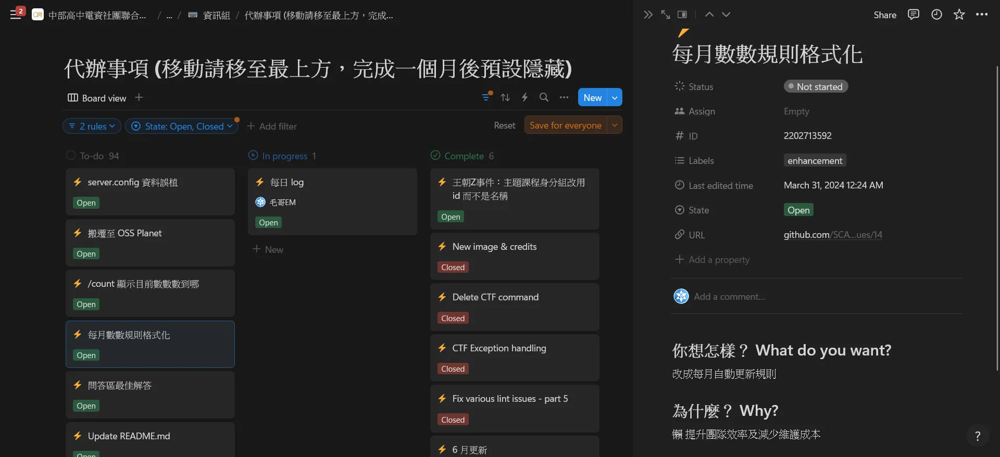

# 用 GitHub Actions 把 Issue 同步到 Notion

> 白居易在看到滿滿的 issue 後不經感嘆：「野火燒不盡，春風吹又生。」然後毅然決然地把 issue 同步到 Notion，這樣就不會忘記了。

> 今日範例程式: <https://github.com/Edit-Mr/2024-GitHub-Actions/tree/main/18>

今天，我們將介紹如何編寫一個自定義的 GitHub Actions，將 GitHub 的 issue 自動同步到 Notion。這個工具將使你能夠將 GitHub 的問題跟踪和管理整合到 Notion 的資料庫中，讓問題管理更加高效。



## 實作

### 事前準備：建立 Notion 整合

首先請你參考昨天的步驟，建立一個 Notion 整合。請至 [Notion Developers](https://www.notion.so/my-integrations) 創建一個新的整合，並獲取 API 密鑰，然後整合至 Workspace。這個 API 密鑰將用於訪問 Notion 的 API，以便將 GitHub 的 issue 同步到 Notion 中。

### 步驟 1：設置專案結構

首先，創建一個新的 GitHub 存儲庫來容納我們的自定義 Action。結構如下：

```
github-issue-2-notion/
├── action.yml
├── script.js
└── README.md
```

今天我們直接使用 Node.js 來編寫。

### 步驟 2：編寫 Action 配置文件

在 `action.yml` 文件中，定義 Action 的輸入、執行和輸出。以下是 `action.yml` 的內容：

```yaml
name: "Sync GitHub Issues to Notion"
description: "Synchronize GitHub issues to a Notion database"
inputs:
  repo:
    description: "The GitHub repository (e.g., owner/repo)"
    required: true
  NOTION_API_KEY:
    description: "The API key for the Notion integration"
    required: true
  NOTION_DATABASE_ID:
    description: "The ID of the Notion database"
    required: true
runs:
  using: "node20"
  steps:
    - name: Run script
      uses: actions/setup-node@v3
      with:
        node-version: "20"
    - run: npm install
    - run: node script.js
      env:
        GITHUB_TOKEN: ${{ secrets.GITHUB_TOKEN }}
        NOTION_API_KEY: ${{ inputs.NOTION_API_KEY }}
        NOTION_DATABASE_ID: ${{ inputs.NOTION_DATABASE_ID }}
```

### 步驟 3：編寫 Node.js 腳本

在 `script.js` 文件中，編寫 Node.js 腳本來實現從 GitHub 獲取 issue 並同步到 Notion。以下是 `script.js` 的完整內容：

```javascript
/** @format */

const core = require("@actions/core");
const axios = require("axios");
const { markdownToBlocks } = require("@tryfabric/martian");

async function main() {
  const repo = core.getInput("repo");
  const notionToken = core.getInput("NOTION_API_KEY");
  const notionDatabaseId = core.getInput("NOTION_DATABASE_ID");

  // GitHub Issues API URL
  const issuesUrl = `https://api.github.com/repos/${repo}/issues?state=all`;

  // Fetch issues from GitHub
  const issuesResponse = await axios.get(issuesUrl, {
    headers: {
      "User-Agent": "request",
      Authorization: `token ${process.env.GITHUB_TOKEN}`
    }
  });

  for (const issue of issuesResponse.data) {
    const issueId = issue.id;
    const notionUrl = `https://api.notion.com/v1/databases/${notionDatabaseId}/query`;

    // Check if the issue already exists in Notion
    const notionResponse = await axios.post(
      notionUrl,
      {
        filter: {
          property: "ID",
          number: {
            equals: issueId
          }
        }
      },
      {
        headers: {
          Authorization: `Bearer ${notionToken}`,
          "Notion-Version": "2022-06-28",
          "Content-Type": "application/json"
        }
      }
    );

    const body = {
      parent: { database_id: notionDatabaseId },
      icon: {
        emoji: "⚡"
      },
      properties: {
        Name: {
          title: [
            {
              text: {
                content: issue.title
              }
            }
          ]
        },
        ID: {
          number: issueId
        },
        State: {
          select: {
            name: issue.state.charAt(0).toUpperCase() + issue.state.slice(1)
          }
        },
        Status: {
          status: {
            name: "Not started"
          }
        },
        Labels: {
          multi_select: issue.labels.map((label) => ({
            name: label.name
          }))
        },
        URL: {
          url: issue.html_url
        }
      },
      children: issue.body != null ? markdownToBlocks(issue.body) : []
    };

    if (notionResponse.data.results.length > 0) {
      console.log(`Issue ${issueId} already exists in Notion, updating it`);
      // Update existing issue
      const notionPageId = notionResponse.data.results[0].id;
      delete body.properties.Status;
      await axios.patch(
        `https://api.notion.com/v1/pages/${notionPageId}`,
        body,
        {
          headers: {
            Authorization: `Bearer ${notionToken}`,
            "Content-Type": "application/json",
            "Notion-Version": "2022-06-28"
          }
        }
      );
    } else {
      console.log(`Creating new issue ${issueId} in Notion`);
      // Create new issue
      await axios.post("https://api.notion.com/v1/pages", body, {
        headers: {
          Authorization: `Bearer ${notionToken}`,
          "Content-Type": "application/json",
          "Notion-Version": "2022-06-28"
        }
      });
      console.log(`Issue ${issueId} created in Notion`);
    }
  }
}

main().catch((error) => {
  console.error(error);
  process.exit(1);
});
```

這裡要來介紹一下裡面使用到的一些套件：

- `axios`: 用於發送 HTTP 請求。
- `@tryfabric/martian`: 用於將 Markdown 轉換為 Notion 的 block。
- `@actions/core`: 用於訪問 Action 的輸入和輸出。

### 步驟 4：設置 GitHub Secrets

在 GitHub 存儲庫的設置中，添加以下 Secrets：

- `NOTION_API_KEY`: 你的 Notion API 密鑰。
- `NOTION_DATABASE_ID`: 你的 Notion 資料庫 ID。

### 步驟 5：創建工作流程文件

在你的 GitHub 存儲庫的 `.github/workflows` 目錄下創建一個新的 YAML 文件，例如 `sync-issues.yml`，並添加以下內容：

```yaml
name: Sync GitHub Issues to Notion

on:
  issues:
    types: [opened, edited, deleted, closed, reopened]
  workflow_dispatch:

jobs:
  sync:
    runs-on: ubuntu-latest
    steps:
      - name: Checkout repository
        uses: actions/checkout@v3

      - name: Sync issues to Notion
        uses: ./path-to-your-action # 使用自定義 Action 的路徑
        with:
          repo: ${{ github.repository }}
          NOTION_API_KEY: ${{ secrets.NOTION_API_KEY }}
          NOTION_DATABASE_ID: ${{ secrets.NOTION_DATABASE_ID }}
```

這個工作流程將在 GitHub 的 issue 有變化時觸發，並運行我們的自定義 Action 來同步 issue 到 Notion。

## 小結

今天我們探討了如何編寫一個 GitHub Actions 來將 GitHub 的 issue 同步到 Notion。通過這個實踐，我們掌握了如何使用 Node.js 和 GitHub Actions 來自動化從 GitHub 獲取問題並更新 Notion 資料庫的過程。希望這篇教程能幫助你更高效地管理問題並保持項目組織的井然有序。
