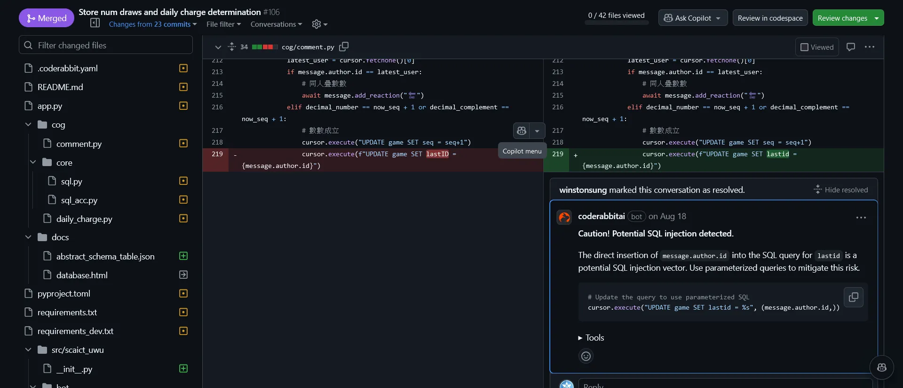
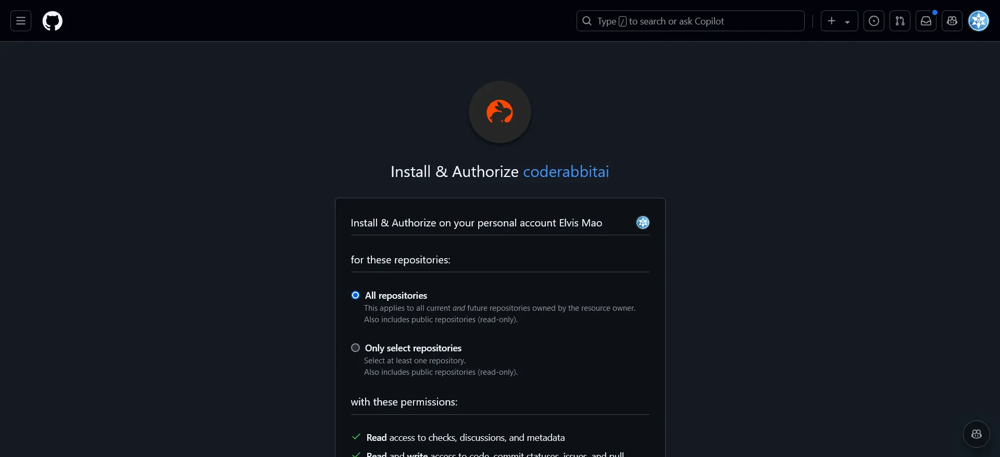
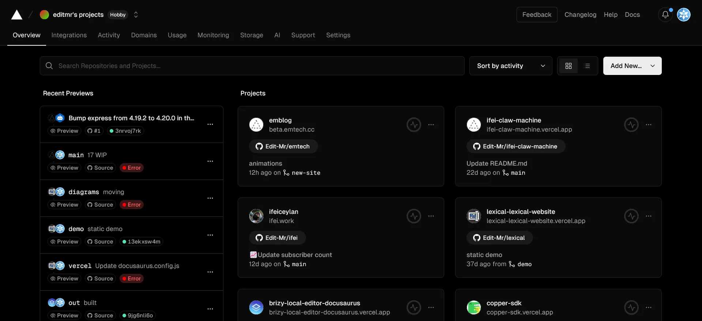
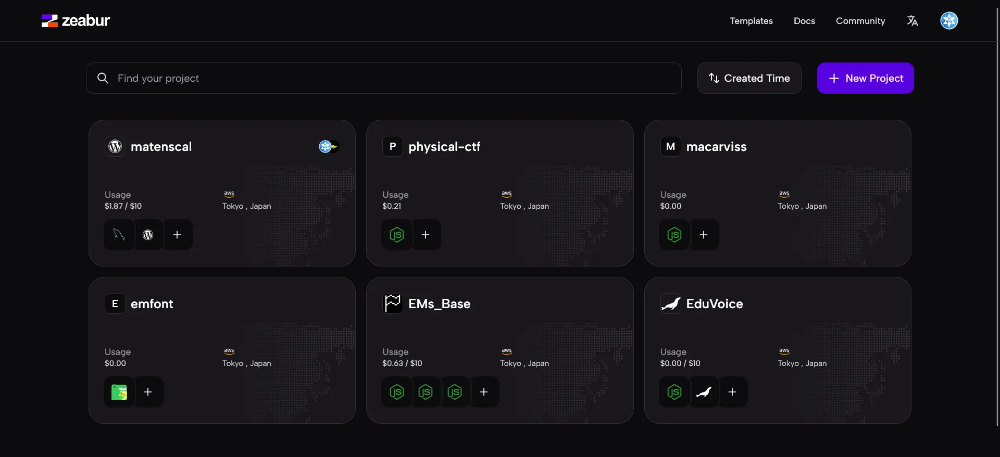
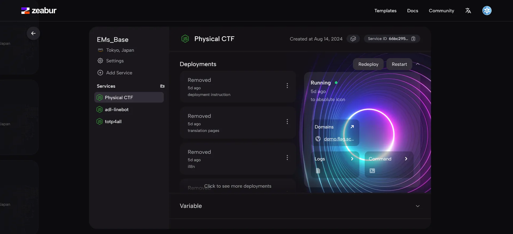

<!-- @format -->

## 萬籟聚集 - 自動化 Issue 管理與集成第三方服務

> 戰國時期張儀遊說各國開放 API 給秦整合，才能夠瓦解合縱聯盟。

在這篇教程中，我們將探討如何集成外部 API 和服務，自動化 GitHub issue 管理，並使用 CodeRabbit 自動進行代碼審查，Vercel 與 Zeabur 來實現自動化部屬。

> 今日範例程式: <https://github.com/Edit-Mr/2024-GitHub-Actions/tree/main/19>

## 自動化 GitHub Issue 管理

### **步驟 1：設置 GitHub Actions 工作流程**

我們首先需要設置一個 GitHub Actions 工作流程，當有新的 issue 創建或更新時，自動執行指定操作。例如，我們可以自動為新創建的 issue 標籤。

在 `.github/workflows` 目錄下創建一個 YAML 文件，例如 `issue-management.yml`，並添加以下內容：

```yaml
name: Manage GitHub Issues

on:
  issues:
    types: [opened, edited]

jobs:
  label:
    runs-on: ubuntu-latest
    steps:
      - name: Checkout repository
        uses: actions/checkout@v3

      - name: Label new issues
        uses: actions/github-script@v6
        with:
          script: |
            const issue = context.issue;
            const labels = ['new-issue'];
            await github.issues.addLabels({
              ...issue,
              labels
            });
```

這個工作流程在每次 issue 被創建或更新時自動為其添加一個標籤 `new-issue`。

### **步驟 2：自動處理 Issue**

假設我們想要在 issue 被標記為 `bug` 時，自動將其分配給一個特定的用戶。我們可以擴展上述 YAML 文件：

```yaml
name: Manage GitHub Issues

on:
  issues:
    types: [opened, edited]

jobs:
  label:
    runs-on: ubuntu-latest
    steps:
      - name: Checkout repository
        uses: actions/checkout@v3

      - name: Label new issues
        uses: actions/github-script@v6
        with:
          script: |
            const issue = context.issue;
            const labels = ['new-issue'];
            await github.issues.addLabels({
              ...issue,
              labels
            });

      - name: Assign bug issues
        if: contains(github.event.issue.labels.*.name, 'bug')
        uses: actions/github-script@v6
        with:
          script: |
            const issue = context.issue;
            await github.issues.addAssignees({
              ...issue,
              assignees: ['specific-user']
            });
```

## 集成第三方服務

有許多第三方服務可以幫助我們提高開發效率，大多不須要手動設定，只需要設置一些配置即可。這裡會介紹幾個我自己常用的服務。

### CodeRabbit 代碼審查

官網：[CodeRabbit](https://coderabbit.io/)

比如說面對中電會大量的代碼審查，有時候難免會出現遺漏的情況，這時候就可以使用 CodeRabbit 來自動進行代碼審查。CodeRabbit 對於開源專案是完全免費的。



你只需要註冊並安裝至你的 GitHub 存儲庫，然後設置一些基本配置，就可以開始使用了。CodeRabbit 會自動檢查你的代碼，並提供有關代碼品質和風格的反饋。



你可以建立 `.coderabbit.yaml` 文件來配置代碼審查的規則，例如以下是我們[中電喵](https://github.com/SCAICT/SCAICT-uwu/tree/main)的設置：

```yaml
# yaml-language-server: $schema=https://coderabbit.ai/integrations/schema.v2.json
language: "en-US"
early_access: false
tone_instructions: "You are a smart cat"
reviews:
  profile: "assertive"
  path_instructions:
    - path: "templates/*.html"
      instructions: "All text should follow sparanoid/chinese-copywriting-guidelines. There should be space between English and Chinese."
  request_changes_workflow: false
  high_level_summary: true
  poem: true
  review_status: true
  collapse_walkthrough: false
  auto_review:
    enabled: true
    drafts: true
    base_branches:
      - main
      - development
chat:
  auto_reply: true
```

### Vercel 部署

官網：[Vercel](https://vercel.com/)

Vercel 是一個 serverless 的部署平台，可以幫助你快速部署靜態網站、API 和 Serverless 函數。只需將你的代碼推送到 GitHub 存儲庫，Vercel 將自動構建和部署你的應用程序。



Vercel 最方便的是它會在每次代碼推送後自動部署你的應用程序，你不需要手動操作。你可以訪問 Vercel 的控制台來查看應用程序的部署狀態和日誌。

你可以使用 `vercel.json` 設置自動部署的規則，或是重新導向規則。例如只在特定分支推送時部署，或者只在特定時間部署。這樣可以確保你的應用程序始終保持最新狀態。

比如說我最用的就是在某些分支取消自動部屬，因為有些東西就是還沒做完每天都要看他噴錯寄 email 罵我也是很煩的。

> 參考配置：https://vercel.com/docs/projects/project-configuration

```json
{
  "git": {
    "deploymentEnabled": {
      "main": false,
      "new-site": false
    }
  }
}
```

或著是你可以設定一些簡單的重新導向規則：

```json
{
  "redirects": [
    { "source": "/me", "destination": "/profile.html", "permanent": false }
  ]
}
```

## Zeabur 自動化部屬

官網：[Zeabur](https://zeabur.com/)

Zeabur 是一個可以幫助你部署服務的平台，而且只需要透過幾個簡單的按鈕即可完成，無論你使用什麼程式語言或開發框架。Zeabur 採用按量計費的方式，你只需要為你的服務實際用到的資源付費，而不需要為整個伺服器付費。



如果你只是要部屬 serverless 函數，Zeabur 是完全免費的。你可以在 Zeabur 的控制台上查看你的服務的部署狀態和日誌，並設置自動部署規則。



通常 99% 的時間你不會需要，但你可以使用 `zbpack.json` 文件來配置你的服務，例如以下是一些簡單的配置範例：

```json
{
  "build_command": "npm install && npm run build:dist"
}
```

```json
{
  "start_command": "php artisan migrate && _startup"
}
```

## 小結

今天，我們探討了如何使用 GitHub Actions 自動化 issue 管理，並集成外部 API 來提高開發效率，並確保代碼品質。希望這篇教程能幫助你更高效地管理項目和代碼。
