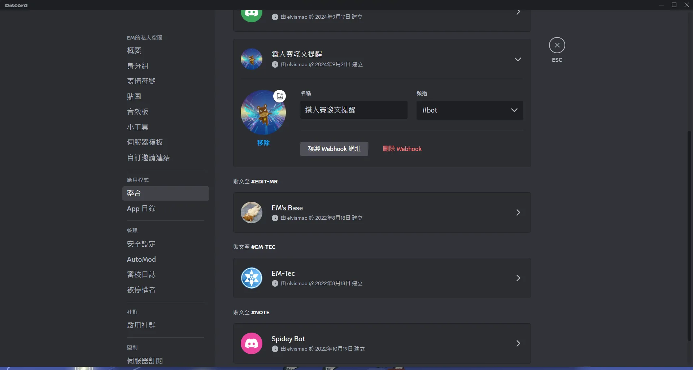

# 鐵人賽怕忘記發文？讓 GitHub Action 每小時提醒你！

倒數第二天了，各位今年有參加鐵人賽嗎？記得去年寫[【不用庫 也能酷 - 玩轉 CSS & Js 特效】](https://ithelp.ithome.com.tw/users/20139821/ironman/6133)的時候緊張到好幾天晚上做惡夢夢到忘記發文，不過今天我心裡特別平安，因為我寫了一個 GitHub Action 來提醒我每小時發文。


它的原理很簡單，就是每小時觸發一次 Action，然後使用靜態爬蟲爬取我的鐵人賽頁面，檢查是否有今天的文章，如果沒有就發送一封郵件給我。
今天就讓我們一步步來實作這個 Action 吧！

> 今日範例程式: <https://github.com/Edit-Mr/2024-GitHub-Actions/tree/main/29>
> 其實如果你有發現的話，這個 repo 底下一直有一個 check 資料夾，這個就是每天提醒我發文的 Action。

## 實作爬蟲

### 觀察頁面

我們先實作一個簡單的爬蟲，來爬取我的鐵人賽頁面，然後檢查是否有今天的文章。觀察一下可以發現鐵人賽每頁只會顯示 10 篇文章，所以我們需要根據日期來判斷今天是第幾天，要看第幾頁的資料。比如說要看第二頁的資料就是：

```url
https://ithelp.ithome.com.tw/users/20139821/ironman/7503?page=2
```

再觀察一下可以發現顯示天數的 HTML 結構是這樣的：

```html
<span class="ir-qa-list__days ir-qa-list__days--profile ">DAY 1 </span>
```


所以我們只需要到正確的頁面找到有沒有這串文字就可以了。

### 初始化 Node.js 專案

首先我們先在 GitHub 上建立一個新的專案，然後在本地初始化一個專案。今天我們來使用 Yarn 來初始化專案。

```bash
mkdir remind-me-to-post
cd remind-me-to-post
git init
yarn init
yarn add node-fetch
```

這裡我們使用 `node-fetch` 來發送 HTTP 請求，這樣我們就可以在 Action 中使用這個套件來爬取網頁。因為我們只是要檢查是否有今天的文章，所以不需要使用 Puppeteer 這種重量級的爬蟲套件，或是 Cheerio 這種解析 HTML 的套件。

### 實作爬蟲

```javascript
import fetch from "node-fetch";

const now = new Date();
const nowUTC8 = new Date(now.getTime() + 8 * 60 * 60 * 1000);
// minus 2024/9/15, calculate how many days after.
const days = Math.floor(
  (nowUTC8 - new Date("2024-09-14")) / (24 * 60 * 60 * 1000)
);
const url =
  "https://ithelp.ithome.com.tw/users/20139821/ironman/7503?page=" +
  Math.ceil(days / 10);

fetch(url)
  .then((res) => res.text())
  .then((html) => {
    // remove all tabs and spaces in the html
    const htmlNoSpace = html.replace(/\s/g, "");
    // check if html include <spanclass="ir-qa-list__daysir-qa-list__days--profile">DAY5</span>
    //console.log(htmlNoSpace); // The raw HTML of the page

    if (
      !htmlNoSpace.includes(
        `<spanclass="ir-qa-list__daysir-qa-list__days--profile">DAY${days}</span>`
      )
    ) {
      // call discord webhook, and send message to discord
      fetch(process.env.DISCORD_WEBHOOK, {
        method: "POST",
        headers: {
          "Content-Type": "application/json"
        },
        body: JSON.stringify({
          content: `@everyone 第${days}天的文章還沒發布喔！`
        })
      })
        .then(() => {
          console.log(
            "Day",
            days,
            "not published yet. Message sent to Discord."
          );
        })
        .catch((err) => {
          console.error("Error sending message to Discord:", err);
        });
    }
  })
  .catch((err) => {
    console.error("Error fetching page:", err);
  });
```

來看一下這段程式碼：

1. 首先我們取得現在的日期，然後計算到 2024/9/15 之後幾天。
2. 根據天數計算出我們要爬取的頁面。
3. 使用 `node-fetch` 發送 HTTP 請求，取得頁面的 HTML。
4. 移除 HTML 中的空白字元，然後檢查是否有今天的文章。
5. 如果沒有今天的文章，就使用 Discord Webhook 來發送訊息給我。
6. 如果有任何錯誤，就印出錯誤訊息。

### 設定 Discord Webhook 至 GitHub Secrets

這裡我們使用 Discord Webhook 來發送訊息給我，所以我們需要先設定一個 Webhook。首先我們需要在 Discord 上建立一個伺服器，然後建立一個文字頻道，然後在頻道設定中找到 Webhook，然後建立一個 Webhook。



建立 Webhook 之後，我們就可以取得 Webhook 的 URL，然後設定到 GitHub 的 Secrets 中。

### 撰寫 GitHub Action

接著我們就可以撰寫 GitHub Action 來執行這個爬蟲了。

```yaml
# @format

name: 鐵人賽發文檢查

on:
  # every hour from 12:00 to 23:00
  schedule:
    - cron: "0 4-16 * * *"
  workflow_dispatch:

jobs:
  run-check:
    runs-on: ubuntu-latest

    steps:
      - name: Checkout Repository
        uses: actions/checkout@v3

      - name: Set up Node.js
        uses: actions/setup-node@v3
        with:
          node-version: "20"
      - name: Change Directory to 'check'
        run: cd check

      - name: Install Dependencies
        run: yarn install
        working-directory: ./check

      - name: Run Node.js Script
        run: node index.mjs
        working-directory: ./check
        env:
          DISCORD_WEBHOOK: ${{ secrets.DISCORD_WEBHOOK }}
```

這裡要注意由於 GitHub Action 的時區是 UTC，所以我們需要將時間 +8 小時，這樣才能在正確的時間執行 Action。這裡我們設定每小時執行一次，從凌晨 12 點 (因為這時候我通常還沒睡，或是一早能看到)。接下來是從中午 12 點到晚上 11 點每個小時執行一次。

### 執行 Action

最後我們就可以將這個 Action 推送到 GitHub 上，然後等待每個小時的提醒了。

```bash
git add .
git commit -m "feat: add remind me to post"
git push origin main
```

這樣我們就可以在每個小時收到提醒了，不用擔心忘記發文了！
